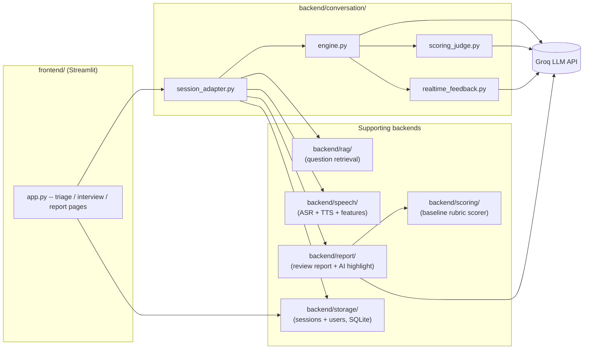

# AI Interview Coach

A Streamlit app that runs a full mock technical/behavioral interview end to
end -- diagnoses which job type and difficulty fit the candidate, conducts
a multi-topic voice-or-text interview with an LLM interviewer, gives
real-time coaching feedback after every answer, and produces a structured
review report (per-dimension scores, sentence-level highlights, a progress
trend across past sessions) once the interview ends.

Built as a solo, week-numbered project; every design decision, trade-off,
and accuracy-evaluation result along the way is recorded in
[`docs/decision_log.md`](docs/decision_log.md) rather than only living in
commit messages -- that log is the most complete account of how (and why)
this was built.

## What it does

1. **Triage**: a short conversational questionnaire (`backend/diagnosis/`)
   infers job type and difficulty level from the candidate's own
   description of their background, rather than asking them to self-select
   from a dropdown.
2. **Interview**: an LLM interviewer (Groq, `backend/conversation/`) runs a
   3-topic interview -- one behavioral, one technical, one case-analysis
   question per session, drawn from a 200-question retrieval-augmented
   question bank (`backend/rag/`) rather than freely hallucinated. The
   interviewer adapts persona (friendly/technical/strict) to the
   configured interview stage and decides per-answer whether to follow up
   or move on, via a lightweight Groq judge call
   (`backend/conversation/scoring_judge.py`).
3. **Voice, optionally**: candidates can answer by voice (faster-whisper
   ASR) and hear the interviewer's questions spoken back (Piper TTS,
   three distinct voice profiles per persona) -- `backend/speech/`.
4. **Real-time coaching**: after every answer, a short "coach aside" (not
   part of the in-character dialogue) flags content/structure issues and
   suggests more natural phrasing (`backend/conversation/realtime_feedback.py`).
5. **Review report**: once the interview ends, answers are scored on four
   rubric dimensions (structure completeness, keyword coverage, logical
   coherence, specificity -- `docs/scoring_rubric.md`) by an embedding-based
   baseline scorer (`backend/scoring/`), with sentence-level highlights
   explaining *why* each score landed where it did, an AI-picked "best
   moment" of the interview, and a trend chart against the candidate's own
   past sessions (`backend/report/`, `frontend/app.py`'s report page).
6. **Accounts**: username/password login (`backend/storage/user_db.py`,
   PBKDF2-HMAC-SHA256, no third-party auth dependency) so session history
   and the trend chart are scoped per candidate.

## Architecture



`models/` (plain dataclasses -- `InterviewSession`, `Question`, `User`,
`ReviewReport`, etc.) is the shared schema every layer above serializes
to/from; it has no dependency on any other project module, by design.

## Tech stack

| Layer | Choice | Why (see decision log for the full reasoning) |
| --- | --- | --- |
| UI | Streamlit | fastest path to a usable multi-page app for a solo project |
| LLM | Groq (Llama models) | fast + cheap inference, generous free tier for a portfolio project |
| ASR | faster-whisper | runs CPU-only, no cloud STT dependency/cost |
| TTS | Piper | local, no cloud TTS dependency/cost, per-persona voice tuning |
| Embeddings | sentence-transformers (`paraphrase-multilingual-MiniLM-L12-v2`) | one model covering both Chinese and English (decision 13) |
| Vector search | ChromaDB | lightweight, file-persisted, no separate service to run |
| Storage | SQLite | zero-ops persistence appropriate for a single-instance app |
| Auth | stdlib `hashlib.pbkdf2_hmac` | no new dependency for a solo-practice tool with no untrusted external users (decision 43) |

## Getting started

See [`docs/deployment.md`](docs/deployment.md) for full setup (local venv
or Docker), required environment variables, and first-run behavior
(model/voice downloads, vector index build). Short version:

```bash
python3 -m venv .venv && source .venv/bin/activate
pip install -r requirements.txt
echo "GROQ_API_KEY=your-key-here" > .env
streamlit run frontend/app.py
```

## Testing

```bash
pytest tests/
```

Test coverage spans the scoring rubric, RAG retrieval, the RAG-aware
question-picking and report-generation wiring inside the conversation
adapter, speech feature extraction (rate/pause/filler detection over
synthetic transcripts), real-time feedback response parsing, and user
account creation/authentication. A handful of things are deliberately
*not* unit-tested and instead validated by scripted real-API smoke tests
(`scripts/smoke_test_week12.py`, `scripts/smoke_test_week13.py`,
`scripts/test_conversation_live.py`, `scripts/test_voice_conversation.py`)
and manual UI walkthroughs -- anything that needs a live Groq call, a real
audio file, or the full Streamlit session-state lifecycle end to end. See
`docs/decision_log.md` decision 45 for the current state of that trade-off.

## Scoring accuracy

The baseline (non-LLM) rubric scorer's accuracy against 150 human-reviewed
labeled answers is tracked in
[`results/baseline_accuracy.md`](results/baseline_accuracy.md), generated
by `scripts/evaluate_baseline.py`. This is an actively-tracked, honestly
-reported number, not a marketing claim -- see decision log entries 23,
27, 29, and 45 for the evaluation methodology and the specific accuracy
fixes made (and still pending) along the way.

## License

[PolyForm Noncommercial 1.0.0](LICENSE) -- personal, educational, and
non-commercial use only (decision 28). This is "source-available," not
OSI-certified "open source," since it restricts commercial use.

## Project log

Every week of this project (scope, design decisions, trade-offs, test
results, and known limitations) is recorded in
[`docs/decision_log.md`](docs/decision_log.md). Other reference docs:

- [`docs/scoring_rubric.md`](docs/scoring_rubric.md) -- the four-dimension
  scoring rubric the baseline scorer implements
- [`docs/week4_tech_spec.md`](docs/week4_tech_spec.md) -- the original
  speech-feature-extraction technical spec
- [`docs/persona_prompts_design.md`](docs/persona_prompts_design.md) --
  interviewer persona/prompt design notes
- [`docs/deployment.md`](docs/deployment.md) -- run instructions
